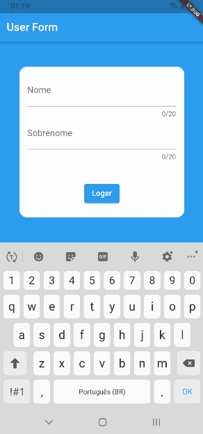
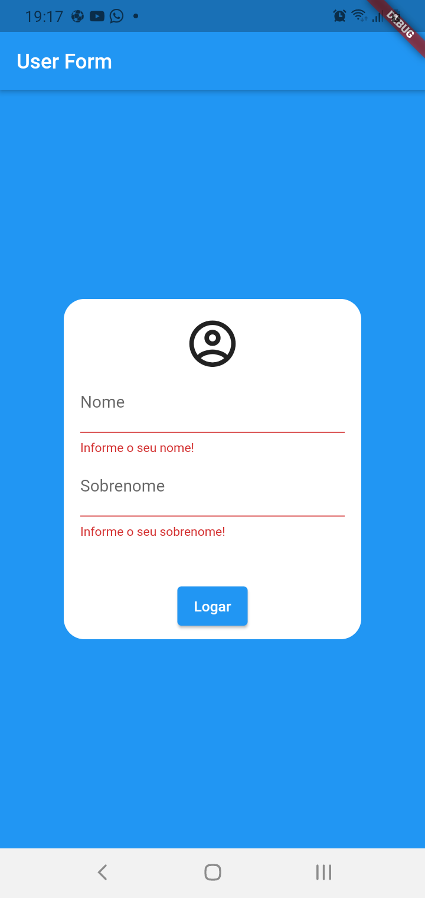
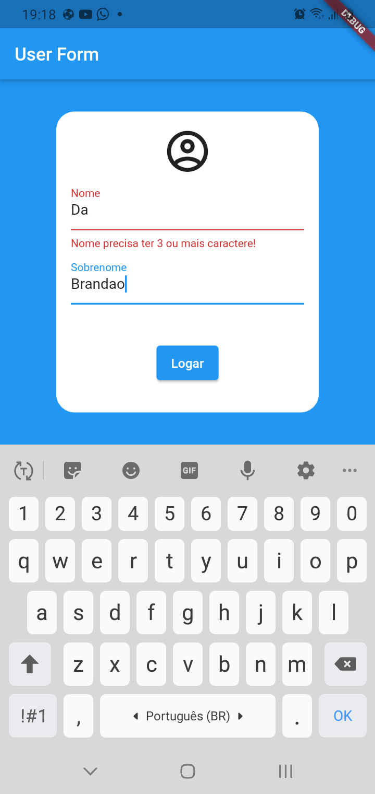
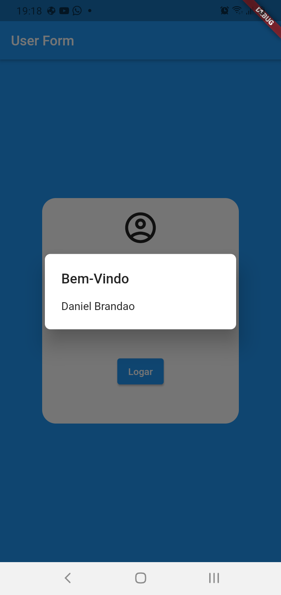

<h1 align="center">
    Cubos Academy  
</h1>

 User Form com MVC 
  

[//]: # (Adicione seus gifs / imagens aqui:)

 
   

 
   

   
  
  
  

## **Informações:**
[//]: # (Descreva seu objetivo e o que foi usado no projeto:)
  
<i><h4><strong>Foi criado estrutura MVC neste app.</strong></h3></i>

* <i><h3><strong>Desafio</strong></h3></i>
  
* Criar um formulário com algumas validações.
  
* Criar responsivo

## **Linguagens e Ferramentas:**
[//]: # (Adicione os recursos do seu projeto aqui:)

- <code></code> **Flutter**
- <code></code> **Dart**

